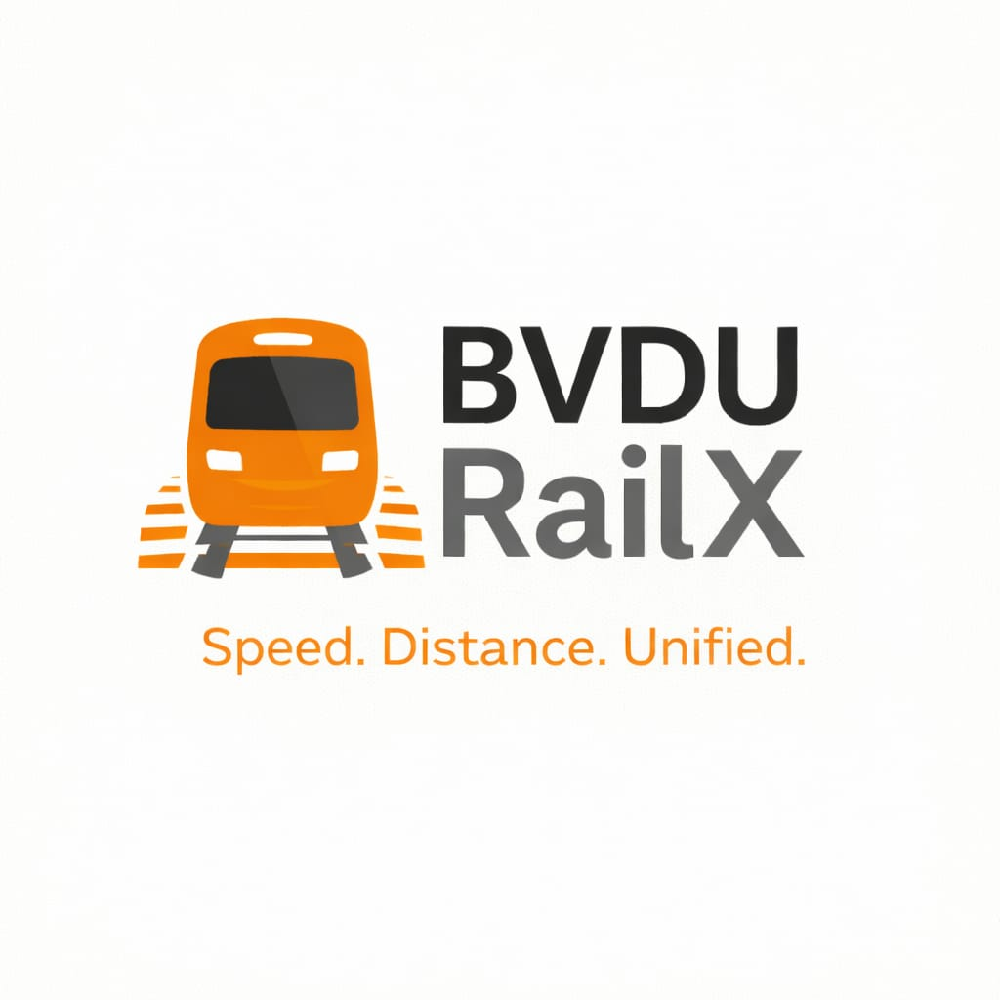

# 🚆 BVDU-RailX

  

<h1 align="center">BVDU-RailX</h1>

<b>Multi-line Rail Network Simulation & Routing Engine</b>

<i>Speed. Distance. Unified.</i>

---

Multi-line rail network simulation and routing engine built in C.

---

## 🚧 Status

🚀 Development in progress  
Core architecture planning phase.

---

## 📌 Project Overview

BVDU-RailX is a console-based rail network simulation system designed to:

- Model multi-line railway systems
- Simulate Fast, Slow, and Special trains
- Calculate optimized routes based on time
- Handle transfer penalties between lines
- Implement structured file handling in C
- Support Admin and Regular user modes

---

## 🏗 Planned Features

- Graph-based routing engine (BFS / Dijkstra-based time optimization)
- Multi-line rail network modeling
- Train categorization (Slow / Fast / Special Fast)
- Transfer time logic (+10 min standard penalty)
- Time and fare calculation engine
- File-based storage for stations, routes, and trains
- Admin login for route and train management
- User login for route search and journey details

---

## 🧠 System Design Focus

- Structured system architecture  
- Algorithm-driven routing logic  
- Modular C programming  
- File handling & persistent storage  
- Clean terminal-based UI  

---

## 👥 Project Team

- **[Adarsh Satyajit Adhikary](https://github.com/kaiadhikary)** – Lead Developer & System Architecture  
- **[Achyut Nayan](https://github.com/AchyutNayan-techworks)** – Algorithm Design & Flowchart Engineering  
- **[Ayush Shashibhushan Tripathi](https://github.com/4yushTripathi)** – Documentation & Project Reporting  

---

## 🏷 Part of BVDU Projects

Developed under the **BVDU project series**.

> Speed. Distance. Unified.
