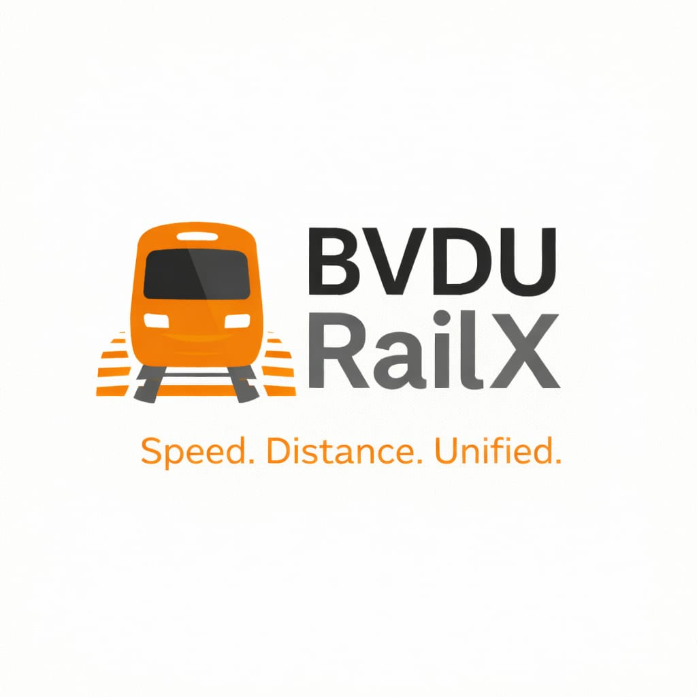

# 🚆 BVDU-RailX

<p align="center">
  
</p>

<h1 align="center">BVDU-RailX</h1>

<p align="center"><b>Multi-line Rail Network Simulation, Routing & Ticketing Engine</b></p>

<p align="center"><i>Speed. Distance. Unified.</i></p>

---

A modular, high-performance C-based railway routing, timetable, and interactive ticketing system. Built using Dijkstra's shortest-path algorithm, line transfer penalty logic, dynamic fare calculations, and live seat inventory management.

---

## 🚀 System Status

✅ **Core Engine Complete**  
Fully functional modular system with pathfinding, multi-line schedules, real-time seat matrices, and PNR ticket reservations.

---

## 📌 Project Overview

**BVDU-RailX** is a console-driven rail transit simulation and booking platform designed to:

- **Model Multi-Line Networks**: Represents 3 distinct rail lines serving different urban needs (Residential, Commercial, Interstate Express).
- **Time-Optimized Pathfinding**: Uses Dijkstra's algorithm to calculate optimal routes prioritized by total travel duration.
- **Interchange Delay Logic**: Automatically incorporates a **+10 minute transfer delay** when passengers switch lines at interchange hubs.
- **Service Classification**: Distinguishes between **Slow Commuter Trains** (stop at every local station) and **Fast Expresses** (bypass local stops to connect Major Hubs).
- **Interactive Ticket Booking**: Renders visual 20-seat matrices (`🟢 OPEN` vs `❌ BOOKED`), generates unique 10-character PNRs, and handles seat cancellations in real-time.
- **Multi-Day Timetable Engine**: Formats departure and arrival schedules into human-readable clock times (`Day X, HH:MM`).

---

## 🗺 Network Topology (50 Stations Across 3 Lines)

| Line Identifier | Corridor Purpose | Stations | Key Characteristics |
| :--- | :--- | :---: | :--- |
| ⬛ **Black Line** | Residential Commuter Corridor | **25** | Short station spacing (2–5 km). Local commuter trains & fast expresses. |
| ⬜ **White Line** | Commercial Business District | **9** | Medium spacing (4–8 km). Connects tech parks, towers, and trade ports. |
| 🩶 **Grey Line** | Long-Distance Express & Freight | **16** | Massive gaps (150–280 km). Interstate routes taking 2–3 days. |

### 🔁 Major Interchange Junctions
* **Nexus Central**: Central Common Hub connecting **ALL 3 LINES** (Black 🔁 White 🔁 Grey).
* **Glenwood Crossing**: Transfer junction between **Black Line** and **White Line**.
* **Ironwood Park**: Transfer junction between **Black Line** and **Grey Line**.

---

## 🏗 System Architecture & Directory Structure

The system is built around a modular C design centered on `main.c` as the master control hub:

```text
bvdu-railx/
├── Makefile                     # Build automation script
├── README.md                    # Project documentation
│
├── data/                        # Network & reference database
│   ├── railx_master_network.txt # Raw network graph database
│   └── stations_directory.txt   # 50-Station human-readable reference
│
├── include/                     # Central headers
│   └── railx.h                  # Shared structs (Station, Train, Booking) & prototypes
│
└── src/                         # Modular C source code
    ├── main.c                   # 🌟 MASTER CONTROL HUB & Console UI Loop
    ├── graph.c                  # Dijkstra pathfinding engine & fare calculator
    ├── timetable.c              # Schedule manager & multi-day itinerary calculator
    └── booking.c                # Live seat matrix engine, PNR tracking & cancellation

```

---

## 🧮 Core Algorithms & Mathematical Logic

### 1. Route Optimization (Dijkstra's Algorithm)
The pathfinding engine calculates optimal travel routes across the network using Dijkstra's Algorithm[span_0](start_span)[span_0](end_span)[span_1](start_span)[span_1](end_span). Edge relaxations evaluate paths using cumulative travel time $T_{\text{total}}$[span_2](start_span)[span_2](end_span)[span_3](start_span)[span_3](end_span):

$$T_{\text{new}} = T_{u} + T_{\text{edge}} + T_{\text{transfer}}$$

* **$T_{u}$**: Total accumulated travel time to current station $u$[span_4](start_span)[span_4](end_span).
* **$T_{\text{edge}}$**: Travel time weight for the specific edge connecting station $u$ to station $v$[span_5](start_span)[span_5](end_span).
* **$T_{\text{transfer}}$**: Line transfer penalty of $+10\text{ minutes}$ applied when switching lines at interchange hubs[span_6](start_span)[span_6](end_span).

### 2. Dynamic Fare Pricing
Ticket pricing is computed using a combination of distance, travel time, and service tier surcharges[span_7](start_span)[span_7](end_span):

$$\text{Fare} = \text{Base Fee} + (\text{Distance in km} \times 0.30) + (\text{Duration in Mins} \times 0.05)$$

* **Base Fee**: Standard starting fee ($20)[span_8](start_span)[span_8](end_span).
* **Fast Express Premium**: Fast Express services incur an additional $20\%$ surcharge on the total calculated fare[span_9](start_span)[span_9](end_span).

---

## ⚙️ Compilation & Execution

### Prerequisites
* Any standard C compiler supporting **C99** or later (`gcc` or `clang`).
* `make` build utility (optional).

### Option A: Build with `Makefile` (Recommended)
```bash
# Compile and execute immediately
make run

# Clean build artifacts
make clean

```

---

## 💻 System Features & Walkthrough

### 1. View Network Stations
* **Station Directory**: Displays all stations in the network along with their assigned line numbers[span_0](start_span)[span_0](end_span).
* **Major Hubs**: Identifies primary interchange junctions connecting multiple transit corridors[span_1](start_span)[span_1](end_span)[span_2](start_span)[span_2](end_span).

### 2. Time-Optimized Pathfinding & Routing
* **Shortest Path Calculation**: Uses Dijkstra's algorithm to calculate optimal routes prioritized by travel duration[span_3](start_span)[span_3](end_span)[span_4](start_span)[span_4](end_span).
* **Interchange Delay Logic**: Automatically incorporates a standard +10 minute transfer delay when switching between lines[span_5](start_span)[span_5](end_span).
* **Train Classification Filtering**: Allows users to filter routes by Slow Commuter trains (stopping at all stops) or Fast Express trains (connecting major hubs)[span_6](start_span)[span_6](end_span)[span_7](start_span)[span_7](end_span).

### 3. Multi-Day Timetable & Itinerary Engine
* **Master Timetable View**: Displays departure times, line IDs, and service modes for all scheduled trains[span_8](start_span)[span_8](end_span).
* **Stop-by-Stop Itineraries**: Computes detailed intermediate station arrival times formatted across multi-day trips[span_9](start_span)[span_9](end_span)[span_10](start_span)[span_10](end_span).

### 4. Interactive Seat Booking & PNR System
* **Live Seat Matrix**: Renders visual seat maps showing real-time open (`🟢 OPEN`) and booked (`❌ BOOKED`) seat availability.
* **PNR Generation**: Assigns a unique 10-character PNR receipt upon confirming a ticket reservation.
* **Ticket Cancellation**: Allows passengers to cancel confirmed tickets and automatically releases seats back into available inventory.

### 5. Dynamic Fare Calculation
* **Distance & Duration Pricing**: Computes ticket prices based on physical distance in kilometers and travel duration in minutes[span_11](start_span)[span_11](end_span)[span_12](start_span)[span_12](end_span).
* **Express Surcharges**: Applies service tier pricing adjustments for fast express routes[span_13](start_span)[span_13](end_span).
* 

---

## 👥 Project Team

- **[Adarsh Satyajit Adhikary](https://github.com/kaiadhikary)** – Lead Developer & System Architecture  
- **[Achyut Nayan](https://github.com/AchyutNayan-techworks)** – Algorithm Design & Flowchart Engineering  
- **[Ayush Shashibhushan Tripathi](https://github.com/4yushTripathi)** – Documentation & Project Reporting  

---

## 🏷 Part of BVDU Projects

Developed under the **BVDU project series**.

> Speed. Distance. Unified.
